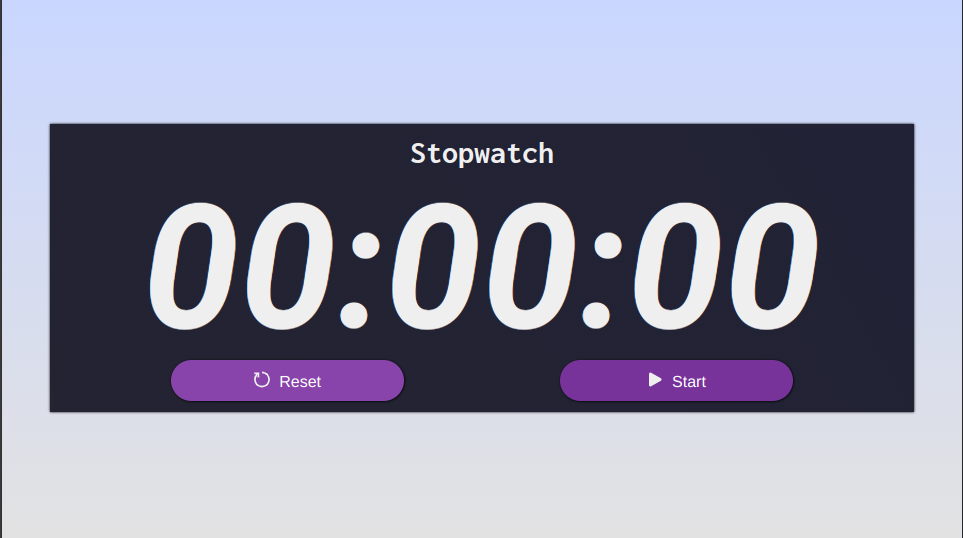
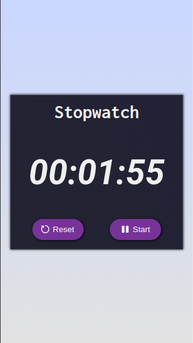

# Stopwatch

The stopwatch I've developed is a web application that allows users to measure time efficiently and accurately. 

Leveraging modern technologies such as Vite for rapid project setup, PostCSS for JavaScript-powered CSS processing, and Vanilla JS and HTML for structure and functionality, this project offers a robust and user-friendly tool.

 This project combines web technologies (HTML, PostCSS, Vanilla JS) with Vite to create a functional and user-friendly stopwatch.

  And this is the result 

- This is what it looks like on a PC with a resolution of 1920x1080:

 

- This is what it looks like on an iPhone SE with a resoution of 375x667:

